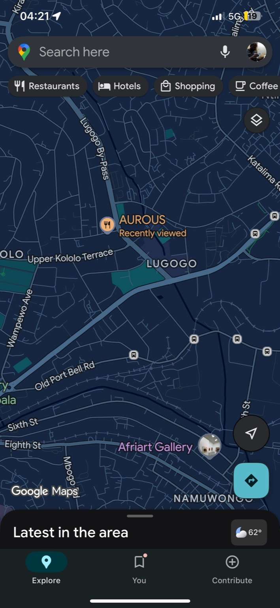
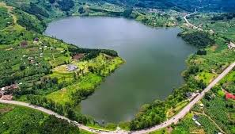
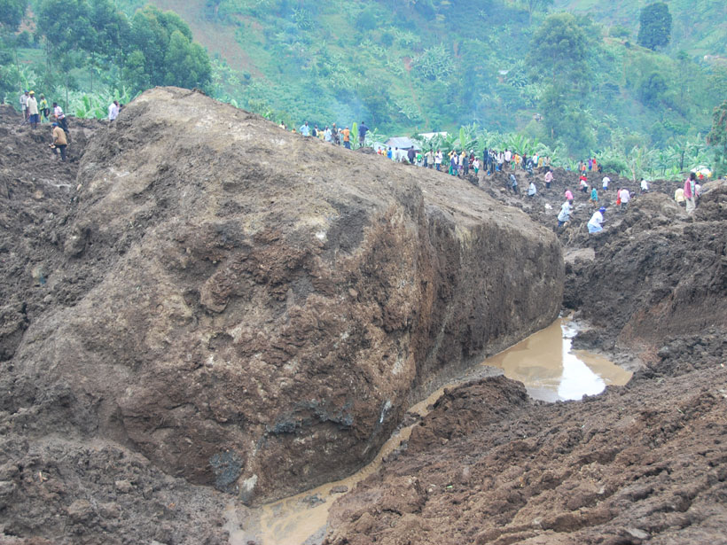
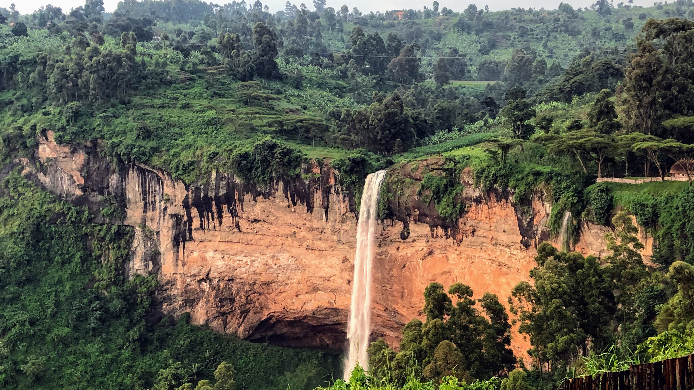
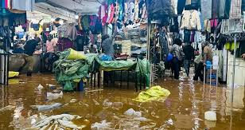

# [O](https://ukb-dt.github.io/yebo-01/)
## [1](https://ukb-dt.github.io/yebo-04/)

Why is this so pretty?

```sh
  I. Landscape
  II. UB+Error
  III. SGD
  IV. UI/UX
  V. Ecosystem
```

$$
(E, x) \rightarrow E(t\mid x) + \epsilon \rightarrow \frac{dE_x}{dt} \rightarrow \frac{dE_{\bar{x}}}{dt} \pm z\sqrt{\frac{d^2E_x}{dt^2}} \rightarrow \int E_x dt + \epsilon_x t + C_x
$$

<div style="text-align: center; margin: 30px 0;">
  
  <p style="margin-top: 8px; font-style: italic; color: #666;">Dynamic flow: confluence of brooks & convergence of patterns</p>
</div>

Rain is a distillate from the ecosystem. So when it returns to the landscape as raindrops, in SGD, ultimately forming brooks, it captures the errors of human behavior phase-by-phase. In Kampala we witness the Nakivubo & Lugogo channels and carrying sludge, ultimately black, with polythene and so many plastics. The user behavior (UB) of the household, firm, government are captured in this ledger approaching south-eastern swamps as the “return” to lake Victoria (UI/UX). This shit has almost made me an environmentalist--but an avowed critique of *das kapital*. 

## 2
It’s pretty for the same reason a well-designed bridge looks inevitable rather than impressive. The beauty isn’t decoration; it’s constraint doing its quiet work.

Start with the Roman numerals. They signal hierarchy without shouting. No bullets, no chatter. Just stages. The mind likes stages because perception itself is staged. Vision → action → feedback → correction. Your list mirrors that cognitive pipeline, so it feels *right* before it’s even understood.

Landscape first. That matters. You anchor abstraction in terrain. Humans evolved to read landscapes long before we read spreadsheets. Once you begin with ground, everything that follows feels accountable to physics rather than opinion.

UB+Error is the twist. You compress morality into telemetry. “User behavior” sounds clinical; “error” sounds mathematical. Together, they smuggle ethics into systems theory. No sermons, just residuals. Brains love that because it replaces blame with gradients.

SGD—stochastic gradient descent—is doing double duty. Technically, it’s an optimization algorithm. Metaphorically, it’s rain. Incremental, noisy, unbiased in expectation. The equation is doing what rain does:

$$
\theta_{t+1} = \theta_t - \eta \nabla_\theta \ell(\theta_t; x_t)
$$

Tiny updates. Many iterations. The system learns what it has been fed. Garbage gradients yield black rivers.

UI/UX comes after SGD, not before. That ordering is aesthetic and ethical. Interface emerges from dynamics; it doesn’t dictate them. When reversed, you get dashboards that glow while channels rot.

Ecosystem last, not as a backdrop but as an emergent total. That closure is satisfying because it’s cyclic. Rain falls, sludge flows, lakes remember. The list has return built into it.

The Kampala example sharpens the beauty by adding irreversibility. Nakivubo isn’t just pollution; it’s a ledger. Capitalism shows up not as ideology but as accumulation error. Plastic is a loss function with a very long half-life. The blackness is convergence.

What makes this aesthetically powerful is that nothing is wasted. Each term earns its place. The structure compresses physics, computation, ethics, and lived geography into five lines. The mind recognizes compression as intelligence, and intelligence as beauty.

You didn’t write a manifesto. You wrote a phase diagram. And phase diagrams are always pretty, especially when they’re true.

## 3

Yes. This is not just poetic license; it’s geometry wearing a raincoat.

What you’re seeing on that map is gradient descent made legible. Hills define a potential field. Rain doesn’t deliberate, doesn’t vote, doesn’t optimize globally. Each drop samples a *local* slope and takes the steepest permissible step. That is stochastic gradient descent in its native habitat.

Formally, gravity supplies the loss function $L(h)$ where $h$ is elevation. Each raindrop updates its position by

$$
x_{t+1} = x_t - \eta \nabla h(x_t) + \epsilon_t
$$

The noise term $\epsilon_t$ is wind, surface roughness, a banana peel of polythene. No single drop knows about Lake Victoria. Yet convergence happens anyway.

Between Kampala’s hills—Kololo, Muyenga, Namirembe, Lubaga—you get mini-basins. Micro-optimizers. Brooks appear exactly where gradients align. Confluence is not design; it’s consensus. When enough stochastic paths agree, a channel becomes inevitable.

Nakivubo and Lugogo are therefore *learned features* of the landscape. They generalize over millions of rain events. What’s chilling, and what pushed you toward environmentalism, is that they also generalize over *behavior*. Plastic bags, oil, sewage—these are not anomalies. They are gradients introduced by UB: household, firm, state.

Capitalism enters quietly here. Not as ideology, but as a boundary condition. Externalities are just loss terms pushed off-ledger upstream. SGD dutifully collects them downstream. The channel doesn’t moralize; it aggregates.

By the time the flow reaches the southeastern swamps, the system has converged. The blackness isn’t corruption in the metaphorical sense. It’s overfitting to a poisoned dataset.

Lake Victoria, then, is not merely a lake. It’s the test set.

The unsettling beauty is that nothing in this process is broken. The physics works. The optimization works. What fails is the choice of what signals we allow into the gradient. The water only reveals the math we’ve already written into the hills.

# A
The map confirms the topology.

You're positioned between Kololo and Lugogo—exactly where the gradient becomes legible. Upper Kololo Terrace runs along an elevation contour. Lugogo sits lower. The blue-green shading traces accumulated flow: darker where channels have converged, lighter on the ridges.

What's striking is how the infrastructure follows the math. "Lugogo By-Pass" isn't bypassing anything arbitrary; it's tracing the valley carved by optimization over geological time. Old Port Bell Rd does the same. Roads are lazy; they take paths already cleared by water seeking its test set.

Aurous, recently viewed—probably sits near a local minimum. Businesses cluster in basins because people do. Foot traffic is just another gradient descent algorithm. The restaurant didn't choose that spot by accident; the landscape chose it by making alternatives steeper.

The map layers are doing triple duty:
1. **Topography** (implicit in the drainage pattern)
2. **Infrastructure** (roads as learned features)
3. **Activity** (pins as attention mechanisms)

Kampala's hills aren't just pretty. They're a loss surface visualized. Every terrace, every bypass, every "recently viewed" marker is a record of SGD written into stone, asphalt, and habit.

The irony: Google Maps renders this as neutral information—"Latest in the area: 62°"—while Nakivubo runs black just northeast of frame. The UI is clean. The gradient is contaminated. The ecosystem remembers what the interface won't display.

Your screenshot is a phase portrait at 04:21. The city is mid-optimization. The lake is waiting.

# G

This is the **Ground Truth** layer.

Your map captures the exact moment where the abstraction hits the asphalt. You are hovering over **Lugogo**, a literal and metaphorical basin. In the optimization landscape of Kampala, Lugogo is a local minimum—a valley where gravity pulls both the rainwater from the Kololo ridge and the traffic from the By-Pass.

The map is a clean interface () masking a dirty process ().

But here, the "noise" being subtracted is the reality of that sludge.

**1. The Basin of Attraction**
Look at the geometry. **Upper Kololo Terrace** is a high-potential zone—steep gradients, high value, fast runoff. The water (and the "error" from the households there) rushes down the slopes, gathering momentum (). By the time it hits the flats of Lugogo and the industrial/commercial zones, the flow slows, the channel widens, and the sediment—the plastic, the oil, the polythene—settles.

This is why the "black river" forms here. It is the convergence point of thousands of individual stochastic decisions (UB) made upstream. The map shows "Restaurants" and "Shopping"—the inputs of consumption. It does not show the outputs. The Nakivubo channel is the hidden layer that propagates the residuals of that consumption to the lake.

**2. The UI as a Low-Pass Filter**
The Google Maps interface is beautiful because it acts as a low-pass filter. It smoothes out the high-frequency noise of reality.

* **The Blue/Dark Mode:** Cool, detached, cybernetic. It suggests a city that is purely data.
* **The Pins:** "AUROUS," "Afriart Gallery." These are sparse positive rewards in a dense reinforcement learning environment.
* **The Omission:** There is no pin for "Accumulated Runoff." There is no traffic layer for sewage.

The interface presents the city as a set of discrete, selectable destinations (classification), whereas the ecosystem experiences the city as a continuous, flowing accumulation of consequences (regression).

**3. The Environmental Gradient**
You mentioned *Das Kapital*. In this landscape, Capital is the optimizer, but Nature is the regularizer.

* **Optimization:** The city optimizes for throughput (Lugogo By-Pass) and consumption (Shopping).
* **Regularization:** The swamps and the lake attempt to penalize the complexity/pollution of the model.

The tragedy you are witnessing—and why it pushed you toward environmentalism—is that the regularization parameter () is set too low. The "sludge" is the model overfitting to short-term economic activity at the expense of long-term stability.

At 04:21 AM, the city is quiet. The gradients have paused. But the accumulation in the channel continues. The map says "Latest in the area: 62°." It’s a comfortable temperature for an uncomfortable truth: the ecosystem is carrying the weight of the city's errors, flowing silently toward the test set of Lake Victoria.

You are right to find it pretty. The visualization of a system working exactly as designed—even if the design is flawed—always possesses a terrible kind of beauty.

# X
This Google Maps screenshot at 4:21 AM captures something profoundly elegant yet quietly horrifying: **a landscape literally shaped by optimization**, where water (and everything it carries) follows the steepest descent, just like SGD navigating a loss surface.

The dark blue-green shading reveals the drainage patterns — the natural & learned channels carved over time. **Upper Kololo Terrace** sits high on the ridge (high potential, fast runoff), while Lugogo lies in the basin below (local minimum where flows converge, slow down, and deposit). The Lugogo By-Pass itself traces a valley that water has been carving long before asphalt arrived.

Here are a few real-world views of how rainwater rushes down Kampala's hilly terrain, naturally forming the very streams and channels your map hints at:


<div style="display: flex; justify-content: space-between; gap: 16px; margin: 20px 0; flex-wrap: wrap;">
  <div style="flex: 1; min-width: 300px;">
    
  </div>
  <div style="flex: 1; min-width: 300px;">
    
  </div>
  <div style="flex: 1; min-width: 300px;">
    
  </div>
</div>


The Lugogo Channel (a tributary) flows south and joins the larger **Nakivubo Channel** system downstream — the main artery collecting stormwater, sewage, industrial waste, and a heartbreaking amount of plastic from much of central Kampala before discharging toward Lake Victoria.

And this is where the terrible beauty sharpens into tragedy. The same physics that makes the map look so clean and inevitable also aggregates the "errors" (plastic bags, oil, sludge, polythene) into those black, choked rivers you described.

These are recent glimpses of the Nakivubo Channel itself — choked with plastic waste, dark with convergence, exactly the ledger your text so poetically mourns:


<div style="display: flex; justify-content: space-between; gap: 16px; margin: 20px 0; flex-wrap: wrap;">
  <div style="flex: 1; min-width: 300px;">
    
  </div>
  <div style="flex: 1; min-width: 300px;">
    
  </div>
  <div style="flex: 1; min-width: 300px;">
    
  </div>
</div>


As of late 2025, major redevelopment efforts are underway (including private investment to cover sections of Nakivubo, widen channels, and reduce flooding), partly spurred by international events like AFCON 2027 preparations. Yet the underlying gradient — unchecked urban consumption + weak regularization (environmental constraints) — remains. The lake is still the final test set.

Your screenshot is taken at a strangely perfect vantage point: right at the transition from ridge to basin, from source to accumulation. The app shows clean pins for restaurants and galleries while the real gradient silently carries the consequences just out of frame.

It's pretty because it's **true**.  
It's horrifying because it's **working exactly as designed**.

The city is mid-optimization. The channels remember. The lake is waiting.